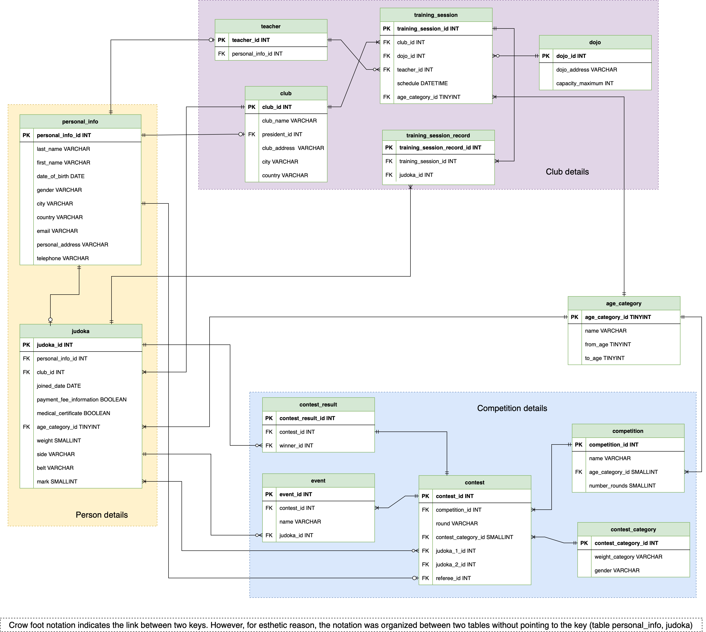

# Judo-club relational database
This project is the first part of the evaluation of relational databases. 

The goal is to identify appropriate Conceptual and Physical Data Models (CDM and PDM) for a real-world data management problem. The overarching objective is to represent data related to the Judo ecosystem, as a first step towards implementing a management application for this subject. 

Judo is a martial art, and a Judoka is a person who practices Judo (for more information, see https://en.wikipedia.org/wiki/Judo). 

-----

## Description about the database: 

The Judo ecosystem involves all activities related to the Judo martial art sport. 
The aim of the data model is to capture and organize the data produced or consumed by these activities:

### Main activities in Judo ecosystem:

1. To practice Judo, individuals must first join a club. This requires registering and providing:
* personal contact information
* paying fees
* a medical certificate. 

Each club has a name, is affiliated with a city, and has a president.

2. Judo sessions are conducted by a Judo teacher and are divided into categories based on the ages of the attendees, including 
* Pre-cadet (8-14 years)
* Cadets (14-17 years)
* Juniors (17-20 years)
* Seniors (20 years and above)
* Masters (30 years and above)

A Judo teacher may work at multiple clubs, while a Judoka is affiliated with only one club.

3. Sessions take place in a Dojo, which is a designated training facility. A club may have multiple Dojos, each with its own postal address and capacity.

4. In addition to regular sessions, some Judokas may participate in competitions. These can be held at a club's Dojo or at public venues like stadiums or concert halls for national or international competitions. Competitions may have restrictions on the age categories of participants.
    
5. In a competition, judokas compete against each other in contests that are overseen by a referee. Each contest involves two judokas. During the contest, different events may occur, including minor penalties (shido), major penalties (hansoku make), successful execution of a technique (Waza-ari), and successful execution of a technique that neutralizes the opponent (Ippon). 

6. Each event is documented with information about the participants (either one or both judokas), the date and time of the event, and the type of event. A contest is won if either the opponent accumulates three shidos or commits one hansoku make, or if the judoka scores two Waza-aris or one Ippon.

7. Competitors in judo contests are divided into weight categories, separate for males and females, and there is no gender or weight mixing in competitions. 

8. Contests typically consist of five rounds, with the final round determining the gold and silver medalists. The third-place bronze medal is awarded to the winners of a separate competition between the quarterfinal losers. 

9. Competitors are identified by characteristics such as their country and continent, preferred side for combat, weight, date of birth, and belt grade. The belt grade represents the judoka's level of skill, with grades ranging from white to black, with red being the highest. 

10. Judokas can earn points by winning contests, with 20 points awarded for each win. Once a judoka has accumulated 100 points, they can take the necessary knowledge tests to qualify for the black belt.

-----
## Entity-Relationship (ER): 

ER diagrams provide a way to visualize the relationships between entities, making it easier to understand the data being stored in a database, and to identify any potential issues or areas for improvement in the design. This helps to ensure that the database is organized, efficient, and flexible enough to accommodate future changes.

-----
## A text file containing CREATE orders using the H2 syntax:

[CREATE file](Judo-create-table.sql)

----- 
## A file containing INSERT statements to provide data for all the tables created:

[INSERT file](Judo-insert-data.sql)

-----
## A file containing SELECT statements providing useful information:

[SELECT file](Judo-select.sql)

-----
The project was created by Ai-My Luong and validated by the supervisor Thomas Broussard at EPITA Paris.
